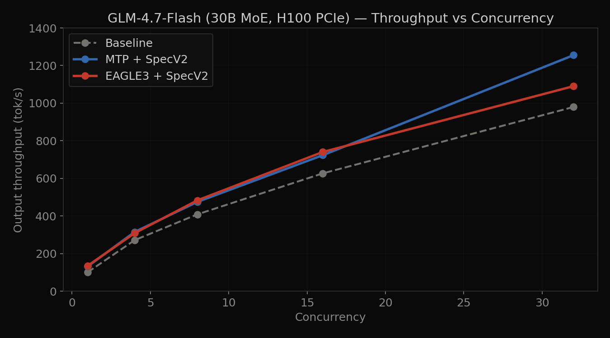
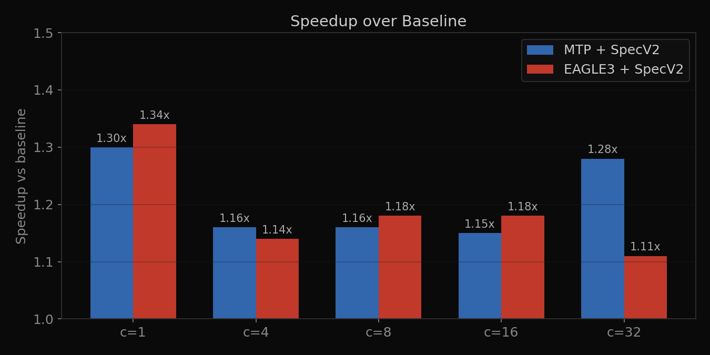
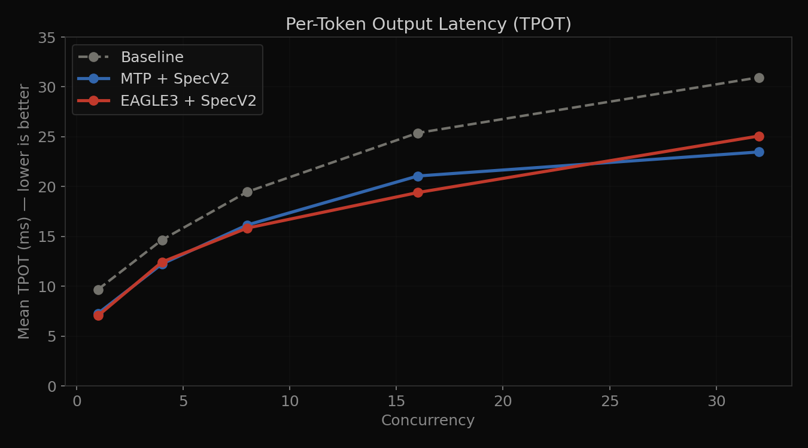
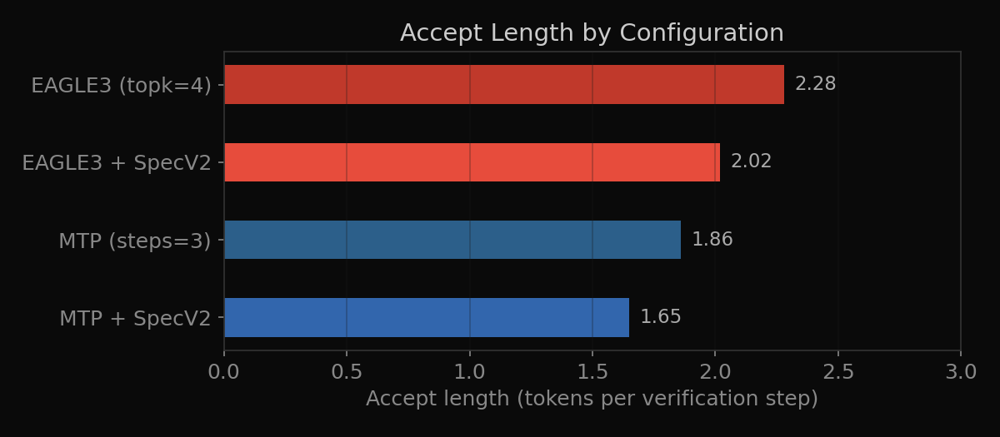

# Speculative Decoding on MoE: MTP vs EAGLE3 on GLM-4.7-Flash

First published head-to-head comparison of MTP, EAGLE3, and SpecV2 overlap scheduling on a Mixture-of-Experts model.

> GLM-4.7-Flash (30B total / 3B active, MoE) · Single NVIDIA H100 80GB PCIe · SGLang 0.5.10 · ShareGPT workload

---

## TL;DR

Neither method universally wins. EAGLE3 delivers the best per-request latency at low concurrency (1.34x at c=1), while MTP achieves the highest system throughput at high concurrency (1.28x at c=32) with zero additional VRAM. The **SpecV2 overlap scheduler** is the single most impactful optimization for both methods.

---

## Results

### Throughput (tok/s)



| Concurrency | Baseline | MTP (SpecV2) | EAGLE3 (SpecV2) | Winner |
| --- | --- | --- | --- | --- |
| 1 | 100.8 | 131.4 | **135.1** | EAGLE3 (1.34x) |
| 4 | 271.5 | **315.2** | 308.9 | MTP (1.16x) |
| 8 | 408.7 | 474.8 | **483.1** | EAGLE3 (1.18x) |
| 16 | 626.5 | 723.1 | **740.3** | EAGLE3 (1.18x) |
| 32 | 979.6 | **1,255.0** | 1,090.3 | MTP (1.28x) |

### Speedup over Baseline



### Per-Token Latency (TPOT, ms) — lower is better



| Concurrency | Baseline | MTP (SpecV2) | EAGLE3 (SpecV2) |
| --- | --- | --- | --- |
| 1 | 9.68 | 7.28 | **7.05** |
| 8 | 19.47 | 16.15 | **15.84** |
| 16 | 25.38 | 21.06 | **19.40** |
| 32 | 30.95 | **23.47** | 25.07 |

### Accept Length



| Method | Accept Length |
| --- | --- |
| MTP (SpecV2) | 1.65 |
| EAGLE3 (SpecV2) | 2.02 |

EAGLE3 accepts 22% more draft tokens per step, but MTP's zero-VRAM advantage closes the gap at high concurrency.

---

## Why This Matters

Published EAGLE3 benchmarks report 3-6x speedups on **dense** models (Llama-3.1-8B). Those numbers don't transfer to MoE. This project measures what actually happens on a production MoE model with only 3B active parameters out of 30B total — a fundamentally different compute profile where verification overhead matters far more.

---

## Setup

| Component | Spec |
| --- | --- |
| GPU | NVIDIA H100 80GB PCIe |
| CUDA | 12.8, Driver 570.195.03 |
| Framework | SGLang 0.5.10 ([Thoughtworks fork](https://github.com/nicetiger/sglang) for EAGLE3 GLM support) |
| Model | [GLM-4.7-Flash](https://huggingface.co/THUDM/GLM-4.7-Flash) BF16 (56.37 GB) |
| EAGLE3 Draft | [thoughtworks/GLM-4.7-Flash-Eagle3](https://huggingface.co/thoughtworks/GLM-4.7-Flash-Eagle3) (291 MB) |
| Dataset | ShareGPT (64 prompts, 28K input / 16K output tokens) |
| Benchmark | `sglang.bench_serving`, 4 warmup, seed=42 |

### Bug fixes

1. Added `self.enable_a2a_moe = False` to `Glm4MoeLiteForCausalLM` (line 438 of `glm4_moe_lite.py`) — parent class checks this attribute but GLM-Flash doesn't set it.
2. Set `SGLANG_ALLOW_OVERWRITE_LONGER_CONTEXT_LEN=1` — draft head has 4096 context vs target's 202752.

---

## Analysis

### SpecV2 overlap scheduler is the biggest lever

Eliminates CPU idle bubbles between draft and verify stages. Impact:

* MTP went from ~1.0x (basically no speedup) to 1.15-1.30x
* EAGLE3 went from 1.07x to 1.11-1.18x

This is a scheduling optimization, not a speculation quality improvement. Requires `topk=1`.

### EAGLE3 has better draft quality, but MoE limits the payoff

EAGLE3's tri-layer feature fusion gives higher accept rates (2.02 vs 1.65). But on a model with only 3B active parameters, per-token compute is already fast — the overhead of running a separate draft model matters more than on dense models where each token is expensive.

### MTP wins at high concurrency because of zero VRAM overhead

MTP uses built-in prediction heads — no extra weights (1.14 GB saved), no extra KV cache. On a model using 56 GB of 81 GB VRAM, that extra memory means more concurrent requests before throughput degrades.

### The crossover is real

EAGLE3 wins at c=1, 8, 16 (latency-sensitive). MTP wins at c=4, 32 (throughput-sensitive). The optimal choice depends on your concurrency profile.

---

## Config Sensitivity

We tested multiple configurations per method to find the best ones above. Key findings from configs that didn't make the cut:

| Config | TPS (c=1) | Accept | Why it lost |
| --- | --- | --- | --- |
| MTP (steps=3, no SpecV2) | 109.0 | 1.86 | Over-drafting, no overlap — basically a wash vs baseline |
| EAGLE3 (steps=5, topk=8, tokens=16) | 120.4 | 2.77 | Higher accept but verification cost killed throughput on MoE |
| EAGLE3 (steps=3, topk=4, no SpecV2) | 127.2 | 2.28 | Best accept rate but no overlap scheduler |

**Takeaway:** On MoE models, minimal drafting + overlap scheduling beats aggressive tree expansion. The opposite of what works on dense models.

---

## Quick Start

```bash
# 1. download models
huggingface-cli download THUDM/GLM-4.7-Flash --local-dir ~/models/GLM-4.7-Flash
huggingface-cli download thoughtworks/GLM-4.7-Flash-Eagle3 --local-dir ~/models/GLM-4.7-Flash-Eagle3

# 2. install thoughtworks fork
git clone https://github.com/nicetiger/sglang.git /tmp/tw-sglang
cd /tmp/tw-sglang && git checkout 0675f95
pip install -e "python/" --no-deps

# 3. apply bug fix (add self.enable_a2a_moe = False at line 438)
# see Bug Fixes section above

# 4. launch server + run benchmarks
./scripts/launch_server.sh mtp-v2          # or baseline, eagle3-v3
./scripts/run_benchmarks.sh mtpv2 30001    # label + port

# 5. generate plots
pip install matplotlib numpy
python3 scripts/plot_results.py
```

---

## Server Commands

**Baseline**

```bash
python3 -m sglang.launch_server \
  --model-path ~/models/GLM-4.7-Flash \
  --tp 1 --trust-remote-code \
  --mem-fraction-static 0.85 --port 30000
```

**MTP (best)**

```bash
SGLANG_ENABLE_SPEC_V2=True python3 -m sglang.launch_server \
  --model-path ~/models/GLM-4.7-Flash \
  --speculative-algorithm EAGLE \
  --speculative-num-steps 1 --speculative-eagle-topk 1 \
  --speculative-num-draft-tokens 2 \
  --tp 1 --trust-remote-code \
  --mem-fraction-static 0.80 --port 30001
```

**EAGLE3 (best)**

```bash
SGLANG_ALLOW_OVERWRITE_LONGER_CONTEXT_LEN=1 SGLANG_ENABLE_SPEC_V2=True \
python3 -m sglang.launch_server \
  --model-path ~/models/GLM-4.7-Flash \
  --speculative-algorithm EAGLE3 \
  --speculative-draft-model-path ~/models/GLM-4.7-Flash-Eagle3 \
  --speculative-num-steps 3 --speculative-num-draft-tokens 4 \
  --speculative-eagle-topk 1 \
  --tp 1 --trust-remote-code \
  --mem-fraction-static 0.80 --port 30002
```

---

## Deployment Guide

| Scenario | Use |
| --- | --- |
| Interactive chat, c ≤ 8 | EAGLE3 + SpecV2 |
| Batch processing, c ≥ 16 | MTP + SpecV2 |
| Memory-constrained | MTP (zero extra VRAM) |
| No draft model available | MTP (uses built-in heads) |

---

## Future Work

* **MoE kernel autotuning** — all benchmarks used default Triton configs. Tuned configs could improve absolute numbers by up to 30%.
* **FP8 quantization** — halves model memory, could change the EAGLE3 vs MTP dynamics at high concurrency.
* **SpecForge draft head retraining** — current head achieves 2.28 accept length. Domain-matched training could push this higher.
* **Output validation** — verify all modes produce identical outputs.

---

## References

* [EAGLE-3 paper](https://arxiv.org/abs/2503.01840) (NeurIPS 2025)
* [SGLang Speculative Decoding docs](https://docs.sglang.io/advanced_features/speculative_decoding.html)
* [SpecForge](https://github.com/sgl-project/SpecForge)
* [Thoughtworks GLM EAGLE3 blog](https://huggingface.co/blog/lujangusface/tw-eagle3-gpu)
* [SGLang SpecV2 Overlap Scheduler](https://www.lmsys.org/blog/2025-12-01-eagle3-vertex/)

## Author

Inesh Reddy — [LinkedIn](https://linkedin.com/in/ineshreddy) · [GitHub](https://github.com/IneshReddy249)
